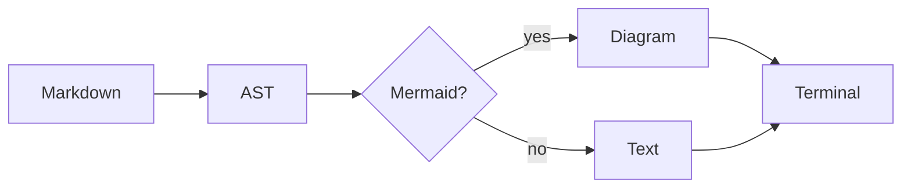

## Flowcharts

A left-to-right flowchart that does not fit the width is laid out top-to-bottom.

```mermaid
flowchart LR
    A[Markdown] --> B[AST]
    B --> C{Mermaid?}
    C -->|yes| D[Diagram]
    C -->|no| E[Text]
    D --> F[Terminal]
    E --> F
```
