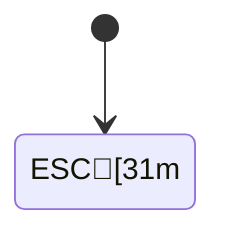

---
# title holds the YAML escapes \e and \a, raw holds a raw ESC byte
title: "\e]0;title from YAML escapes\a"
raw: a raw ESC  in a value
---

# Control characters, ESC [1m: 

Every line of this document ends with CRLF. Each control character below is written as the raw byte, right after its name.

A color sequence, ESC [31m and ESC [0m: red. A window title sequence, ESC ]0; and BEL: ]0;pwned. DEL: . The C1 control U+009B: ›. The invalid byte 0xFF: ÿ.

Character references &amp;#27;, &amp;#7; and &amp;#x9b;: &#27;[31m, &#7;, &#x9b;.

This paragraph has a lone CR here:
the text goes on after it.

## Table

| Bytes | Cell |
|---|---|
| ESC | ab |
| BEL | ab |
| &amp;#27; | a&#27;b |

## Links and images

[A link with a title sequence, ESC and BEL, in the destination](https://example.com/]0;pwned)


## HTML

Inline HTML with ESC [31m: <span></span>

<div>
An HTML block with ESC [31m: 
</div>

## Code

```go
// ESC [31m in a string, highlighted
fmt.Println("")
```

```
plain code with BEL: 
a lone CR follows:
this is the next line
```

## Diagrams

```mermaid
graph LR
    A[ESC: ] --> B[End]
```


