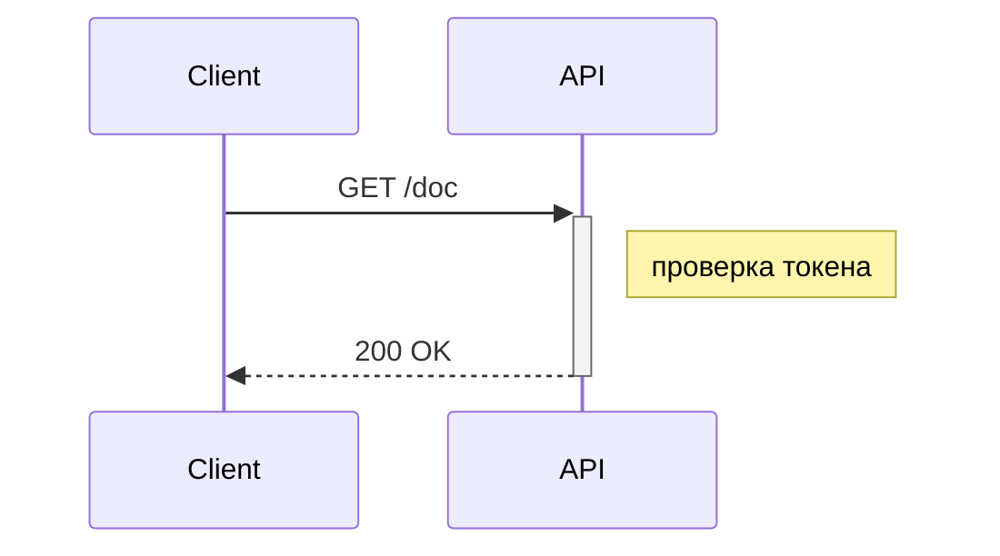
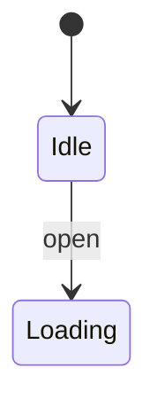

# Diagrams

```mermaid
sequenceDiagram
    participant C as Client
    participant A as API
    C->>+A: GET /doc
    Note right of A: проверка токена
    A-->>-C: 200 OK
```

```mermaid
stateDiagram-v2
    [*] --> Idle
    Idle --> Loading: open
```

The paragraph after the diagrams is rendered normally.
