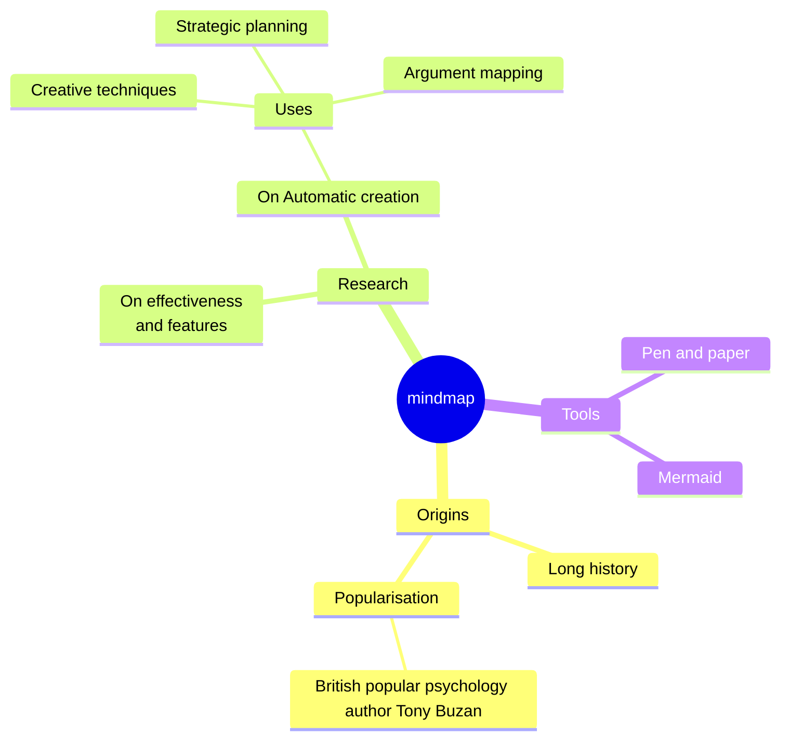
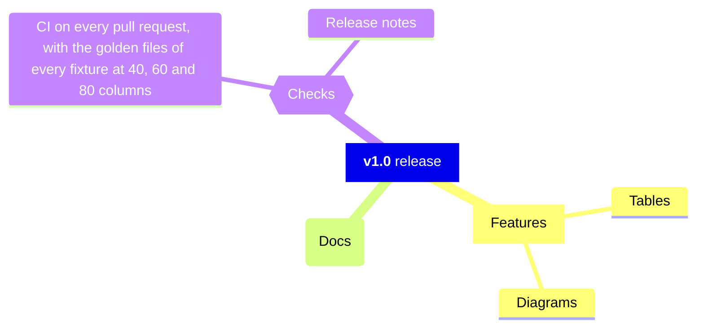

# Mindmaps

```mermaid
mindmap
  root((mindmap))
    Origins
      Long history
      ::icon(fa fa-book)
      Popularisation
        British popular psychology author Tony Buzan
    Research
      On effectiveness<br/>and features
      On Automatic creation
        Uses
            Creative techniques
            Strategic planning
            Argument mapping
    Tools
      Pen and paper
      Mermaid
```

```mermaid
---
title: Release plan
---
mindmap
  root["`**v1.0** release`"]
    a[Features]
      Tables
      Diagrams
    b(Docs)
    c{{Checks}}
      :::urgent
      CI on every pull request, with the golden files of every fixture at 40, 60 and 80 columns
      Release notes
```

```mermaid
mindmap
  First root
  Second root
```

The paragraph after the broken mindmap is rendered normally.
