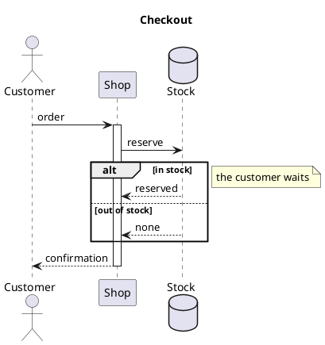
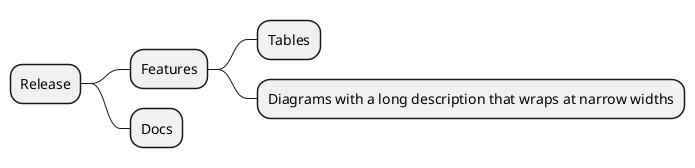
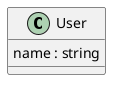
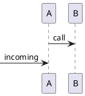

# PlantUML

```plantuml
@startuml
title Checkout
actor Customer
participant Shop
database Stock
Customer -> Shop ++ : order
Shop -> Stock : reserve
alt in stock
  Stock --> Shop : reserved
else out of stock
  Stock --> Shop : none
end
note left : the customer waits
return confirmation
@enduml
```

```puml
Client -> Server : ping
Server --> Client : pong
```

```plantuml
@startmindmap
* Release
** Features
*** Tables
*** Diagrams with a long description that wraps at narrow widths
** Docs
@endmindmap
```

```plantuml
@startuml
class User {
  name : string
}
@enduml
```

```plantuml
@startuml
A -> B : call
[-> A : incoming
@enduml
```

The paragraph after the diagrams is rendered normally.
