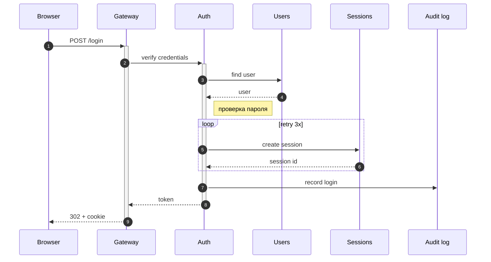

# Regression fixture
## Parameters

| Параметр | Тип | По умолчанию | Описание |
|---|---|---|---|
| `--width` | int | 80 | Максимальная ширина вывода в колонках терминала, после которой текст переносится |
| `--theme` | string | auto | Цветовая тема: dark, light, auto, или путь к JSON-файлу с темой |

## Inline content, emoji, CJK, alignment

| Статус | Имя | Ссылка | Число |
|:---:|---|---|---:|
| ✅ | **жирный** | [docs](https://example.com/very/long/path/to/documentation/page) | 1 |
| ⚠️ | 日本語テキスト | `code \| pipe` | 1000 |
| 👨‍👩‍👧 | обычный | - | 42 |

## Long sequence diagram

## Links

See the [mermaid-ascii repository](https://github.com/AlexanderGrooff/mermaid-ascii) and https://example.com/docs.
