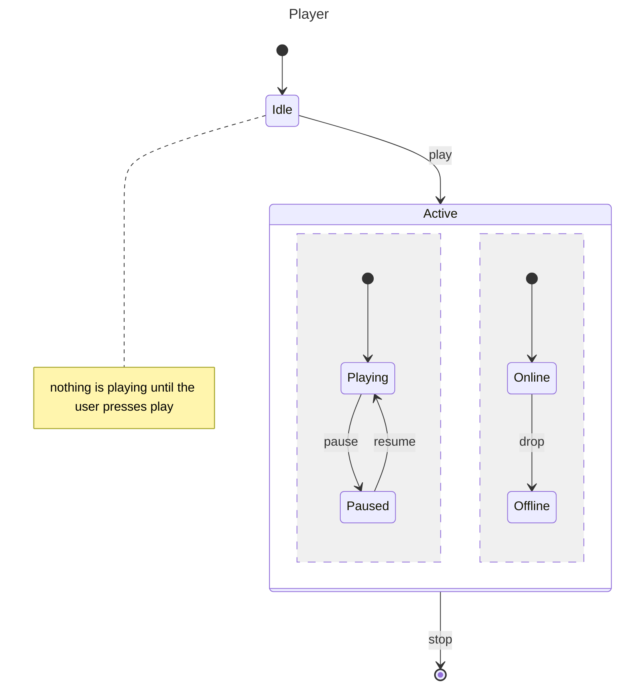
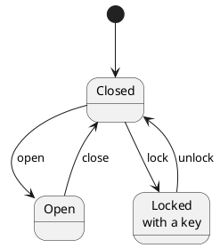

# State diagrams

```mermaid
---
title: Player
---
stateDiagram-v2
    [*] --> Idle
    Idle --> Active : play
    state Active {
        [*] --> Playing
        Playing --> Paused : pause
        Paused --> Playing : resume
        --
        [*] --> Online
        Online --> Offline : drop
    }
    Active --> [*] : stop
    note right of Idle : nothing is playing until the user presses play
```

```plantuml
@startuml
[*] --> Closed
Closed -> Open : open
Open -down-> Closed : close
state "Locked\nwith a key" as Locked
Closed --> Locked : lock
Locked --> Closed : unlock
@enduml
```

```mermaid
stateDiagram-v2
    [*] --> A
    A -> B
```

The paragraph after the diagrams is rendered normally.
